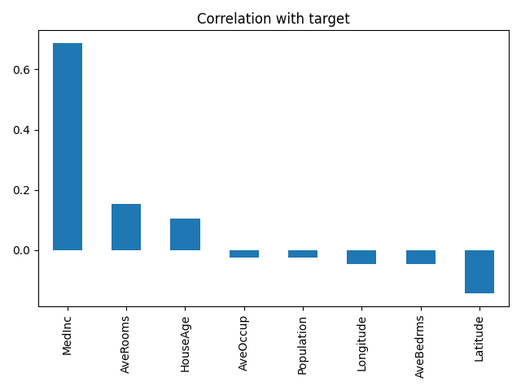
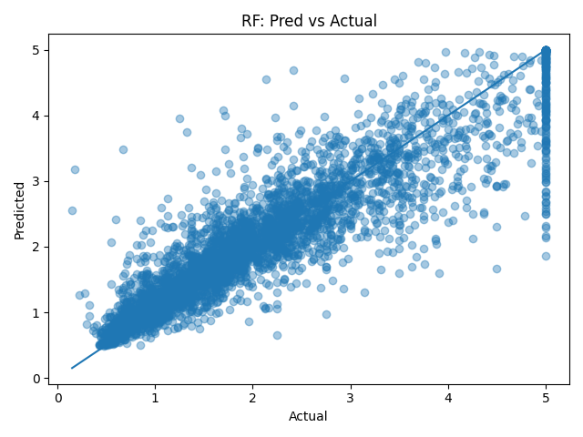
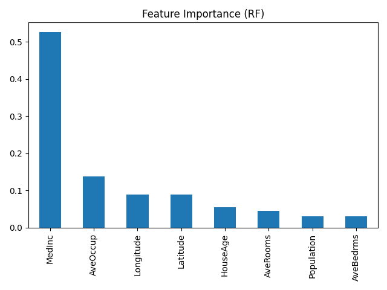

# 🏡 California Housing Price Predictor

A regression project using the **California Housing dataset** (built into scikit-learn).  
The goal is to predict median house values from census block features, and to compare different ML approaches.

---

## 📊 Dataset
- **Source:** [fetch_california_housing](https://scikit-learn.org/stable/modules/generated/sklearn.datasets.fetch_california_housing.html) from scikit-learn.  
- **Size:** ~20,000 rows × 8 features.  
- **Target:** Median house value (in $100k).  

Features include:  
- Median income (`MedInc`)  
- House age (`HouseAge`)  
- Average rooms/bedrooms  
- Population  
- Latitude, Longitude  

---

## 🧠 Models
Three models were trained and compared:  
1. **Linear Regression** (baseline)  
2. **Ridge Regression** (regularized linear model)  
3. **Random Forest Regressor** (nonlinear tree-based model)  

---

## ⚙️ Workflow
1. **EDA**  
   - Summary statistics  
   - Correlations with target  

2. **Preprocessing**  
   - Train/test split (80/20)  
   - Scaling for linear models (StandardScaler pipeline)  

3. **Training & Evaluation**  
   - Metrics: MAE, RMSE, R²  

4. **Visualization**  
   - Predicted vs Actual scatter  
   - Feature importances (Random Forest)  

---

## 📈 Results
| Model                 | MAE    | RMSE   | R²    |
|------------------------|--------|--------|-------|
| Linear Regression      | 0.533  | 0.746  | 0.576 |
| Ridge (α=1.0)          | 0.533  | 0.746  | 0.576 |
| Random Forest (300 est)| 0.327  | 0.503  | 0.807 |


- Linear Regression captured only part of the variance (R² ≈ 0.58) and showed relatively high errors (MAE ≈ 0.53).
- Ridge Regression performed identically to Linear Regression at α=1.0, showing that regularization did not improve the fit on this dataset.
- Random Forest delivered a clear improvement, reducing error significantly (MAE ≈ 0.33) and explaining over 80% of the variance (R² ≈ 0.81). This demonstrates that non-linear, tree-based methods capture complex feature interactions much better than linear approaches.

---

## 🖼️ Sample Plots
- Correlation of features with target  
- Predicted vs Actual house prices (scatter)  
- Feature importance (Random Forest)  





---

## 🚀 Quickstart
Clone repo and install requirements:

```bash
git clone https://github.com/djalilsel/cali_house_predic.git
cd cali_house_predic
pip install -r requirements.txt
